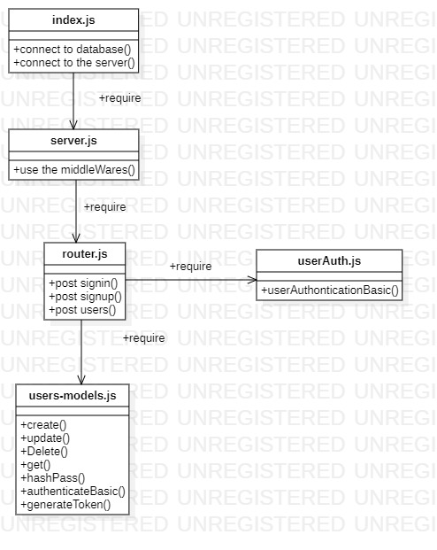

# auth-server
This project is a semulation of how to authonicat and autorize users in the actual API so :

## Prerequisites:

for an Express server that implements Basic Authentication, with signup and signin capabilities, using a Mongo database for storage, we need :

1. `npm install`
2. mongoDb installed locally.
3. a software to deal with server routes
4. `npm start`
5. open the browser on localhost
6. new file in the root of the reposotory `.env`;
## .env File :
make sure to include these guys in your `.env` file

* PORT=`Your Port ex : 3030`
* DATABASE_URL=`your mongo database connsectio strict`
* TOKEN_SECRET=`your seacrit hasing word ex: shhh`

## Technologies
mongoDb installed locally.
a software to deal with server routes
npm start
open the browser on localhost
Technologies
Express
Express Router
dotenv
MongoDB (Mongoose)
Jest & supergoose
Cors and Morgan
Bcrypt & JWT
base64
superagent
## Routs :

`GET`    http://localhost:3030/users
`GET`    http://localhost:3030/secret
`GET`    http://localhost:3030/secretPlus
`GET`    http://localhost:3030/posts
`post`   http://localhost:3030/signup
`post`   http://localhost:3030/signin
`post`   http://localhost:3030/posts
`put`    http://localhost:3030/posts
`delete` http://localhost:3030/posts

## UML :

